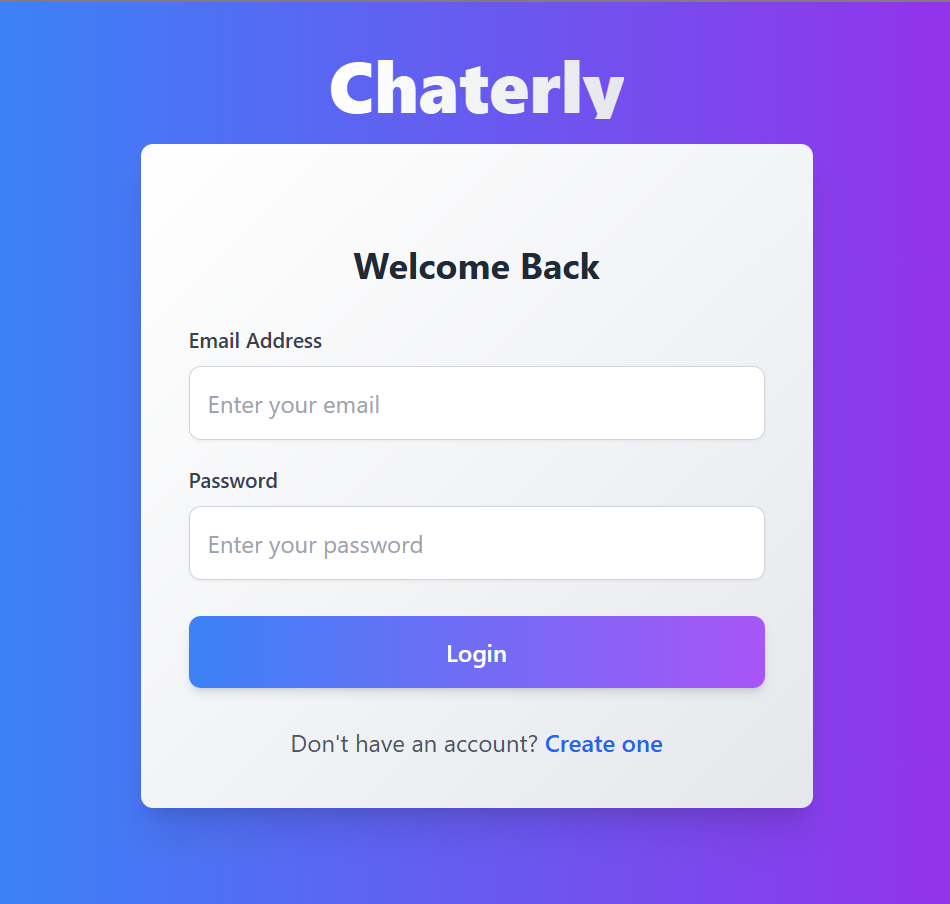
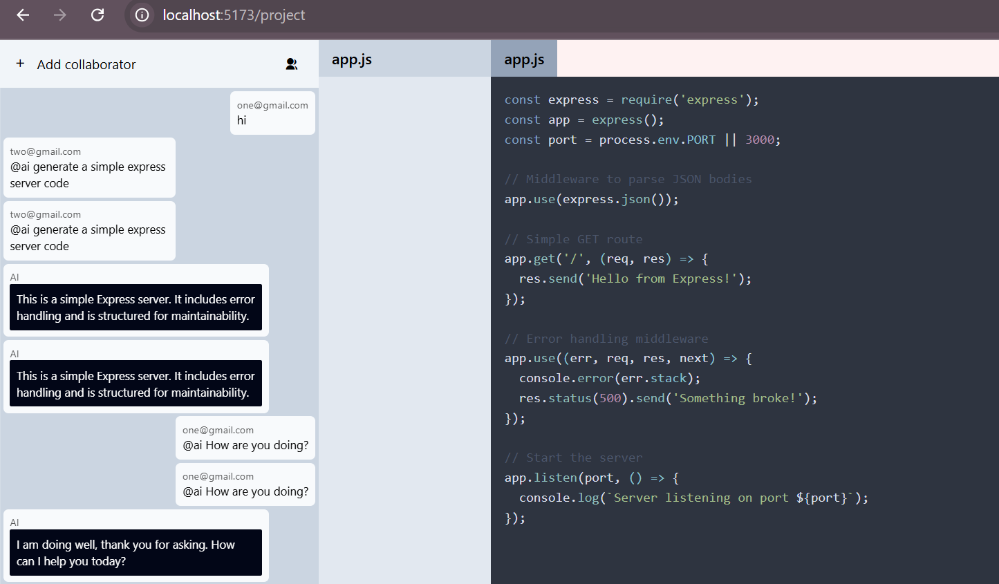

# 🚀 Chaterly - Collaborative Chat with AI Superpowers




Chaterly is a powerful real-time collaboration platform that combines chat functionality with AI assistance, enabling seamless communication and code generation capabilities.

## ✨ Features

### 💬 Real-time Chat
- Instant messaging with collaborators
- Real-time message delivery using Socket.IO
- Invitation system for adding collaborators

### 🤖 AI Integration
- Access AI assistance using `@ai` command
- Natural language conversations with AI
- Express.js code generation (currently the only supported framework)
- Live code execution for Express.js projects

### 🛠️ Development Features
- Complete Express.js project generation
  - Automatic app.js creation
  - package.json generation
- Built-in code execution environment for Express.js
- Real-time collaboration on code

## ⚙️ Current Limitations
- Code generation is currently limited to Express.js projects
- Code execution environment supports Express.js only

## 🔧 Tech Stack

- **Frontend:** React.js
- **Backend:** Node.js, Express.js
- **Database:** MongoDB
- **Caching:** Redis
- **Real-time Communication:** Socket.IO
- **AI Integration:** Gemini AI API
- **Code Execution:** WebContainers
- **Authentication:** JWT

## 🚀 Getting Started

### Prerequisites

```bash
node >= 14.0.0
npm >= 6.0.0
MongoDB
Redis
